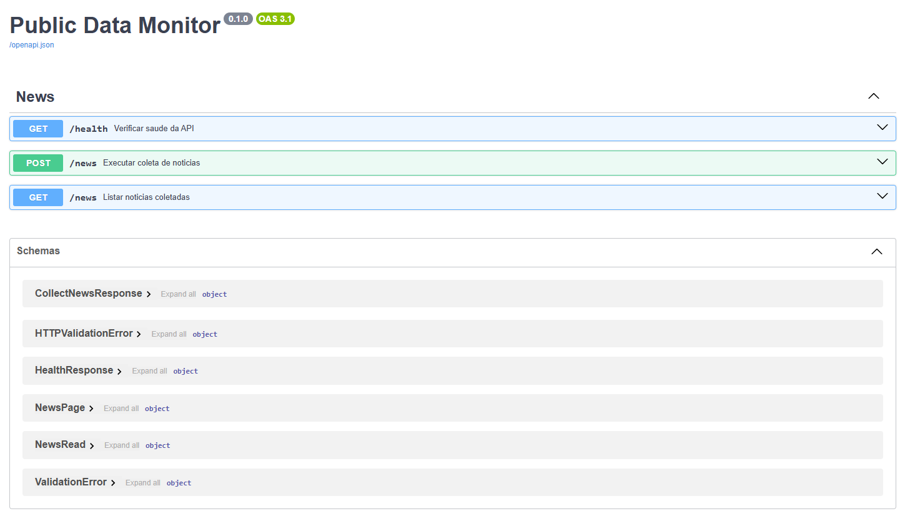
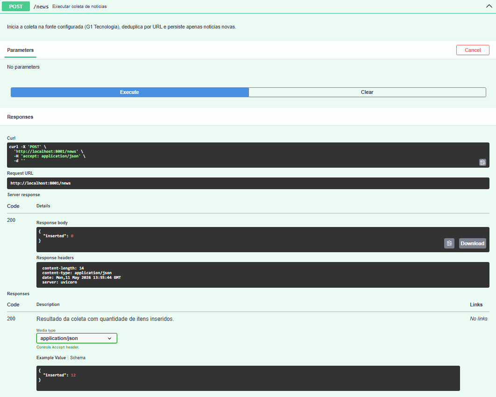
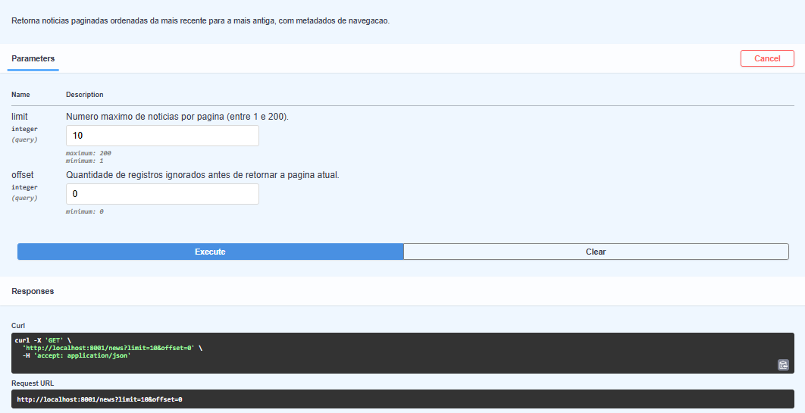
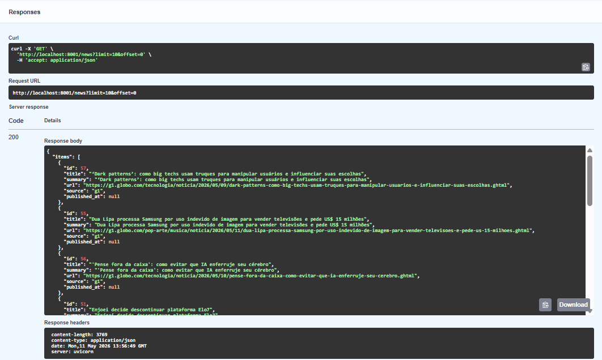
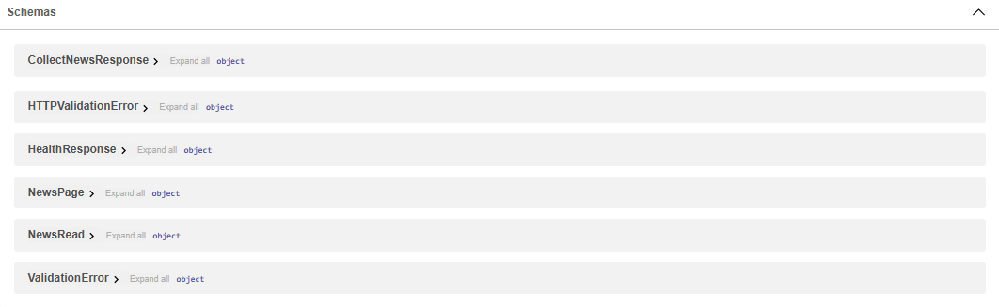

# Public Data Monitor

Pipeline assíncrono para coleta, deduplicação e exposição de notícias públicas via API REST, com FastAPI, PostgreSQL e SQLAlchemy async.

## Features

- Coleta HTTP assíncrona com retry e espera progressiva entre tentativas
- Persistência idempotente com deduplicação por URL (`ON CONFLICT DO NOTHING`)
- API REST paginada com OpenAPI/Swagger em `/docs`
- SQLAlchemy async + PostgreSQL
- Camadas separadas (rotas → serviços → scraper → persistência)
- Docker Compose para ambiente local reproduzível
- Health check em `GET /health` e logging estruturado básico
- **Demo online** no Render — experimente sem clonar o repositório (links abaixo)

## Demo online

Há uma instância pública no [Render](https://render.com/) para abrir a documentação e testar fluxos sem subir Docker localmente:

- [Docs](https://public-data-monitor.onrender.com/docs)
- [Health check](https://public-data-monitor.onrender.com/health)

Prévia da documentação (mesma UI que você vê no `/docs`):



## Objetivo

MVP de coleta e consulta de notícias que demonstre competências de backend de forma legível para quem revisa o repositório (código **e** documentação).

## Tecnologias utilizadas

- Python
- asyncio
- FastAPI
- SQL assíncrono
- Docker
- Organização em camadas

## Requisitos

Antes de rodar o projeto, você precisa de:

- [Docker](https://www.docker.com/)
- [Docker Compose](https://docs.docker.com/compose/)

## Configuração

1. Clone o repositório:

```bash
git clone <url-do-seu-repositorio>
cd public-data-monitor
```

2. (Opcional) copie o arquivo de ambiente de exemplo:

```bash
cp .env.example .env
# No Windows (PowerShell): Copy-Item .env.example .env
```

> O projeto funciona sem arquivo `.env` ao subir via Docker Compose, pois as variáveis
> necessárias já estão definidas no `docker-compose.yml` (incluindo a conexão com o banco).

## Uso

1. Suba os containers sem travar o terminal:

```bash
docker compose up -d --build
```

2. Acesse (local ou demo):

- Local — API: `http://localhost:8001` · Swagger: `http://localhost:8001/docs`
- Demo — [Swagger](https://public-data-monitor.onrender.com/docs) · [Health](https://public-data-monitor.onrender.com/health)

3. Dispare a coleta inicial de notícias:

```bash
curl -X POST http://localhost:8001/news
```

4. Consulte as notícias coletadas:

```bash
curl "http://localhost:8001/news?limit=20&offset=0"
```

## Deploy (Render)

Para rodar no Render com PostgreSQL gerenciado:

- defina `DATABASE_URL` com a connection string do banco;
- se a URL nao vier com `ssl`/`sslmode`, habilite `DB_SSL_REQUIRE=true`;
- o container ja sobe com porta dinamica via `PORT` (fallback `8000`).

## Arquitetura (visão rápida)

```text
Cliente (curl / navegador / outro serviço)
        ↓
FastAPI (rotas + validação + OpenAPI)
        ↓
Camada de serviço (coleta, consulta por id, exclusão administrativa, contagem, listagem)
        ↓
Scraper (HTTP + parse HTML)  →  Persistência (SQLAlchemy async)
        ↓
PostgreSQL
```

## Resiliência de dados

O pipeline assume **fonte externa imperfeita**: HTML muda, campos somem e falhas de rede são transitórias.

- **Data de publicação (`published_at`)**: quando o G1 não expõe a data de forma confiável ou o atributo usado no parse não está presente, o campo fica `null`. A notícia ainda é persistida com título e URL válidos — prioriza **continuidade operacional** em vez de descartar o item inteiro.
- **Deduplicação**: URLs duplicadas não geram segundo registro; reexecuções da coleta são seguras.
- **Scraper**: tentativas múltiplas à API da origem com pausa crescente entre falhas, reduzindo ruído em instabilidade passageira.

## Demonstração (Documentação)

### 1) Tela inicial da documentação

Visão geral dos endpoints disponíveis e organização da API.


### 2) Coleta de notícias (`POST /news`)

Execução da coleta com retorno da quantidade de itens inseridos.



### 3) Listagem de notícias (`GET /news`)

Consulta paginada com `limit` e `offset`, retornando `items`, `total` e `has_next`.

Parameters:  


Responses:  


### 4) Schemas da API

Visualização dos contratos de resposta da aplicação (`HealthResponse`, `CollectNewsResponse`, `NewsRead` e `NewsPage`).



## Endpoints

- `GET /health` — health check da aplicação
- `POST /news` — executa a coleta e persiste notícias novas
- `GET /news` — lista notícias com paginação (`limit`, `offset`)
- `GET /news/{id}` — retorna uma notícia pelo id
- `DELETE /news/{id}` — remove uma notícia (só se `NEWS_DELETE_API_KEY` estiver definida no servidor; envie header `X-API-Key` com o mesmo valor)
- `GET /docs` — documentação interativa da API

Exemplo de resposta paginada:

```json
{
  "items": [],
  "limit": 20,
  "offset": 0,
  "total": 120,
  "has_next": true
}
```

## Convenção RESTful adotada

Para manter consistência com RESTful naming convention:

- usar substantivos no plural para recursos (`/news`);
- usar o método HTTP para representar a ação (`POST /news` coleta/persiste, `GET /news` lista, `GET /news/{id}` detalha, `DELETE /news/{id}` remove quando habilitado);
- evitar verbos na URL (por isso `POST /collect` foi substituído por `POST /news`).

## Estrutura

```text
app/
  api/        # rotas FastAPI + deps (API key opcional)
  core/       # configurações
  db/         # engine e sessão
  models/     # modelos SQLAlchemy
  schemas/    # schemas de resposta
  scrapers/   # scrapers por fonte
  services.py # regras de coleta e consulta
```

## Decisões técnicas

### Persistência idempotente

Inserção em lote com `ON CONFLICT DO NOTHING` no índice único de **URL**, alinhado ao modelo: evita duplicidade quando a coleta roda de novo (manual, agendada ou concorrente).

### Resiliência na coleta

O client HTTP usa **timeout**, **redirects** e **repetição** com espera progressiva entre tentativas em caso de erro transitório, com logs de aviso/erro para diagnóstico.

### Stack async

`asyncio`, `httpx.AsyncClient` e SQLAlchemy async reduzem bloqueio em I/O durante coleta e acesso ao banco.

### Bootstrap do schema

No startup da aplicação, tabelas são criadas a partir do metadata do SQLAlchemy (`create_all`). É adequado para MVP local; em produção madura costuma-se evoluir com migrações (Alembic).

### Contrato da API

Schemas Pydantic com descrições explícitas alimentam o OpenAPI em `/docs`, deixando o comportamento legível sem abrir o código.

## Tradeoffs e evoluções futuras

- **Uma fonte** (G1 Tecnologia): generalizar exige interface de scraper por fonte e possivelmente fila de jobs.
- **Camada de auth**: JWT, OAuth2 ou API keys por cliente (hoje só `DELETE` opcional via `NEWS_DELETE_API_KEY` + header `X-API-Key`).
- **Rate limiting** e proteção na borda (API gateway, reverse proxy) para ambiente público.
- **Cache** (Redis, CDN) em leituras frequentes de `GET /news`, com política de invalidação ou TTL.
- **Fila de tarefas** para coleta assíncrona (desacoplar `POST /news` de jobs longos e escalar workers).
- **Parsing acoplado ao HTML**: quebra quando o site muda; mitigação atual é scraper isolado + testes onde fizer sentido.
- **Sem worker dedicado** por padrão: coleta síncrona na requisição `POST /news`; escala costuma levar fila e consumidores.

## Licença

Este projeto está licenciado sob a [MIT License](./LICENSE).
